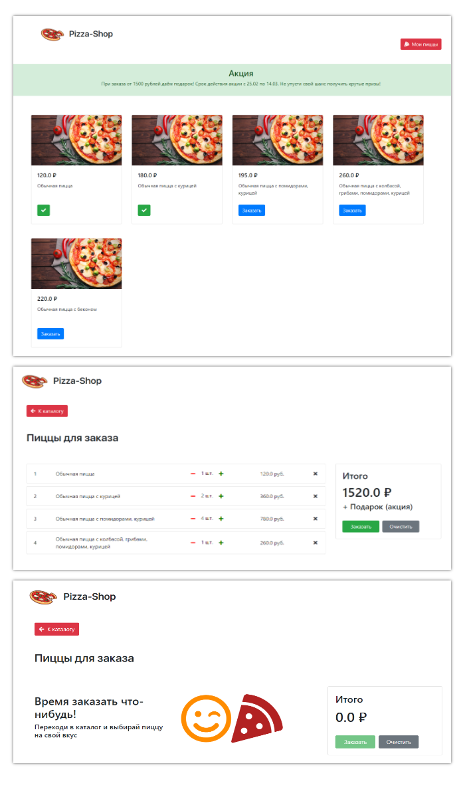

# Pizza-Shop
### Веб-приложение для пиццерии (учебный проект)

#### Возможности:
* выбор товара в каталоге;
* работа с корзиной:
    + ознакомление с полной суммой заказа
    + переход к каталогу
    + удаление товара из корзины
    + увеличение и уменьшение числа заказываемого товара
    + очистка корзины
    + подтверждение заказа

#### Особенности UI:
* адаптивная вёрстка;
* если товар выбран, то его кнопка меняет состояние (повторный выбор невозможен, пока товар не будет удалён из корзины);
* при общей сумме заказов от 1500 рублей в козине появляется дополнительно строка "Подарок" в блоке "Итого".

#### Особенности реализации:
* мини-проект реализован с использованием шаблонов Decorator, Factory Method, Adapter, Singleton (реализация одного из шаблона сделана с ошибкой!);
* в качестве базы данных используется виртуальная БД на базе ArrayList;
* на данный момент работа с веб-приложением рассчитана только на одного человека (упс!);
* сравнение id товара в каталоге и в корзине выполняется посредством класса-обёртки, который позволяет вызвать метод прямо из html (необходим thymeleaf)

#### Превью страниц:

